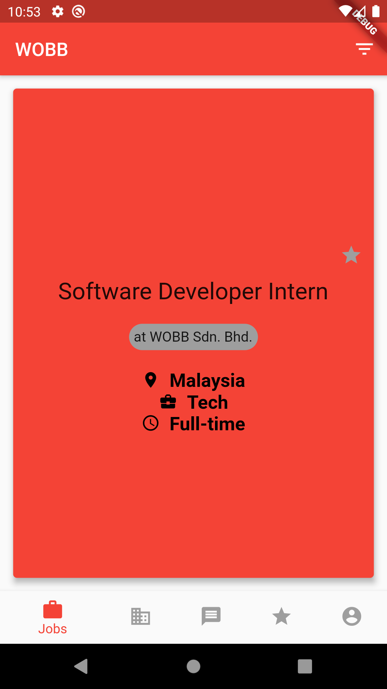
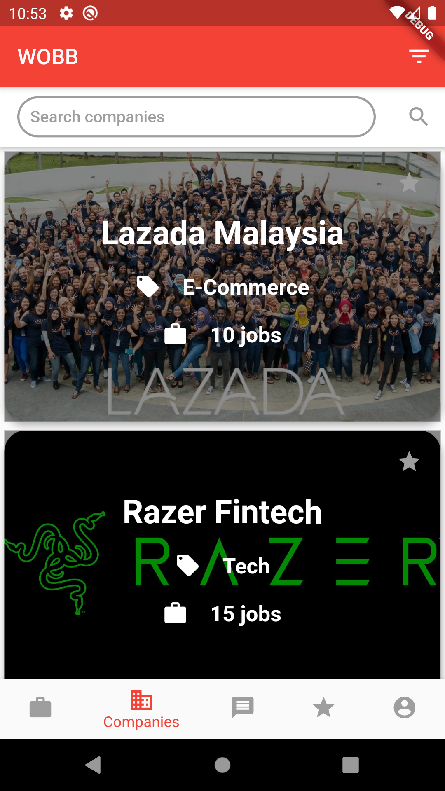
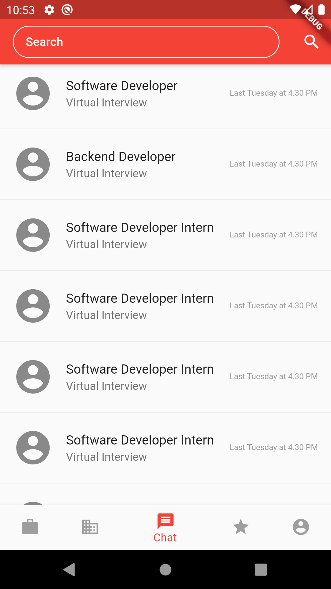
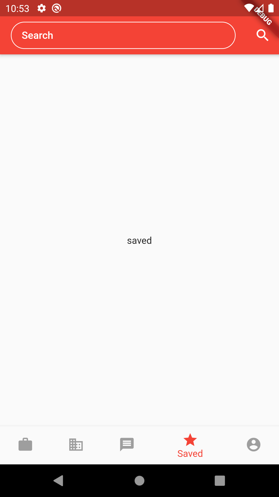
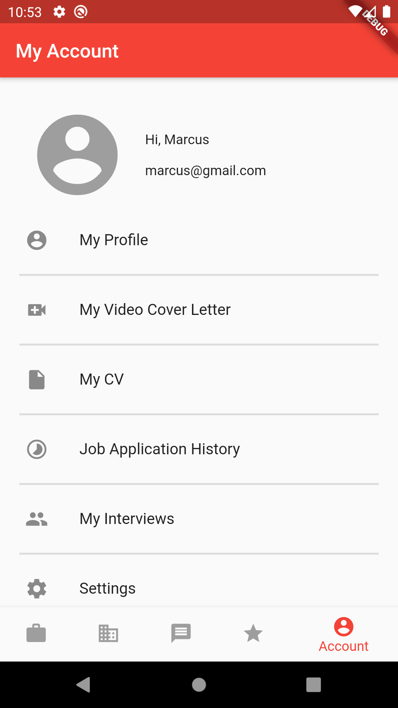

# WOBBClone

A clone UI of the WOBB app. The actual mobile app can be found at Google <a href="https://play.google.com/store/apps/details?id=com.wobb.hunted&hl=en">Play store</a> or Apple <a href="https://apps.apple.com/us/app/wobb-jobs/id981491669">App store</a>. </br>
This app is only a clone and build for specifically for practice. There are still some issues with this app as I am still new to flutter.</br>
This app has only been tested on Oneplus 6 & Pixel 2.

# Getting Started
## 1. Clone the repo
```
$ git clone https://github.com/MarcusLEK/WOBB_clone.git
```

## 1. Installation
To run this flutter app, you will need to do the following
- Install Android Studio
    - Install Dart and flutter plugins on Android Studio
    - https://developer.android.com/studio
- Install Flutter
    - https://flutter.dev/docs/get-started/install

## 2. Running the application
To run the application just, type the following command:
```
$ flutter run
```

# Screenshots






# Issues Faced
## 1. Blurred background not able to be circular
## 2. Not able to add another nav bar below the search tab on the saved tab

